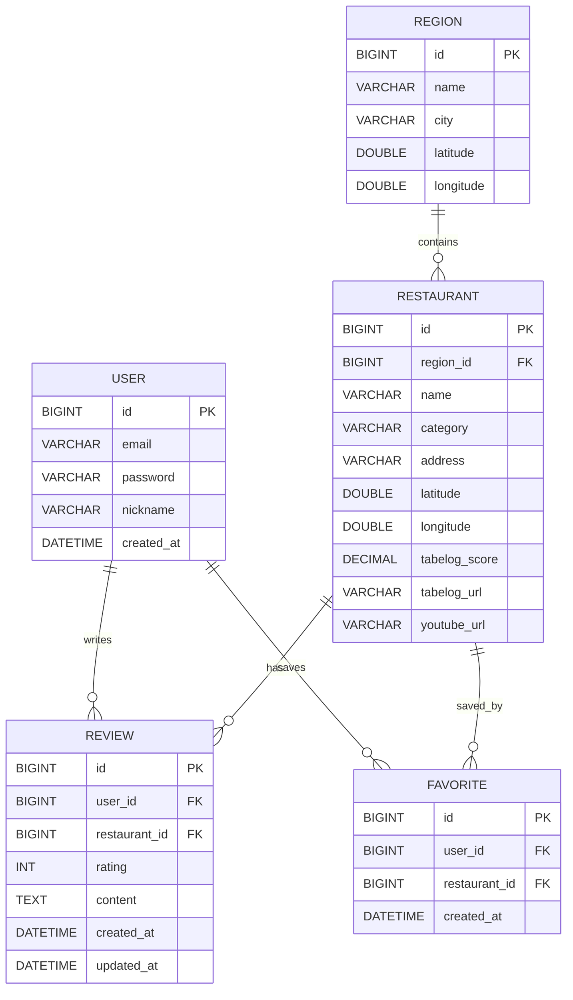

# ERD
---
## Entity List
- USER
- REGION
- RESTAURANT
- REVIEW
- FAVORITE
---
## Entity Description

- USER : 회원가입한 사용자 정보 관리. 사용자는 리뷰를 작성하고 맛집을 즐겨찾기 할 수 있다.
- REGION : 일본의 주요 관광지 위치 또는 주요 지역 위치
- RESTAURANT : 맛집 위치 및 세부 정보 관리. 타베로그 평점, 타베로그 URL, 유튜브 URL, 취급하는 메뉴 종류 등을 포함
- REVIEW : 사용자가 작성한 맛집의 리뷰와 평점 정보. 한 사용자는 한 맛집에 하나의 리뷰만 작성가능하다.
- FAVORITE : 사용자가 북마크한 맛집들. 
---
## Entity Relationship

- USER 1 : N REVIEW
- REGION 1 : N RESTAURANT
- RESTAURANT 1 : N REVIEW
- USER N : M FAVORITE
---
## Entity Relationship Diagram

