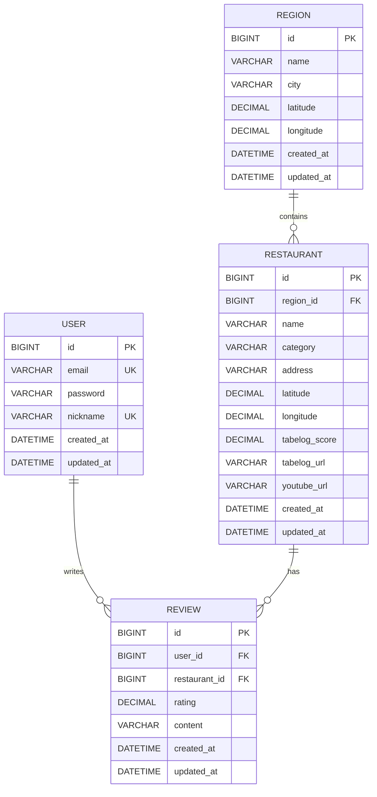

# ERD

## Entity List

- USER
- REGION
- RESTAURANT
- REVIEW

> FAVORITE는 Could 우선순위이므로 핵심 기능 구현 후 추가한다.

## Entity Description

- USER: 회원가입한 사용자 정보. 사용자는 리뷰를 작성할 수 있다.
- REGION: 일본의 주요 관광지 또는 지역 위치.
- RESTAURANT: 맛집 위치 및 상세 정보. 타베로그 평점·URL, 유튜브 URL, 메뉴 종류 등을 포함한다.
- REVIEW: 사용자가 작성한 맛집 리뷰와 평점. 한 사용자는 한 맛집에 하나의 리뷰만 작성할 수 있다.

## Entity Relationship

- USER 1 : N REVIEW
- REGION 1 : N RESTAURANT
- RESTAURANT 1 : N REVIEW

## Entity Relationship Diagram

```mermaid
erDiagram
    USER ||--o{ REVIEW : writes
    RESTAURANT ||--o{ REVIEW : has
    REGION ||--o{ RESTAURANT : contains

    USER {
        BIGINT id PK
        VARCHAR email UK
        VARCHAR password
        VARCHAR nickname UK
        DATETIME created_at
        DATETIME updated_at
    }

    REGION {
        BIGINT id PK
        VARCHAR name
        VARCHAR city
        DECIMAL latitude
        DECIMAL longitude
        DATETIME created_at
        DATETIME updated_at
    }

    RESTAURANT {
        BIGINT id PK
        BIGINT region_id FK
        VARCHAR name
        VARCHAR category
        VARCHAR address
        DECIMAL latitude
        DECIMAL longitude
        DECIMAL tabelog_score
        VARCHAR tabelog_url
        VARCHAR youtube_url
        DATETIME created_at
        DATETIME updated_at
    }

    REVIEW {
        BIGINT id PK
        BIGINT user_id FK
        BIGINT restaurant_id FK
        DECIMAL rating
        VARCHAR content
        DATETIME created_at
        DATETIME updated_at
    }
```

## Database Constraints

- USER의 이메일과 닉네임은 각각 유일해야 한다.
- REGION의 도시와 지역명 조합은 유일해야 한다.
- REVIEW의 사용자와 맛집 조합은 유일해야 한다.
- REVIEW 평점은 0.5 이상 5.0 이하이다.
- RESTAURANT의 타베로그 평점은 값이 있는 경우 0 이상 5 이하이다.
